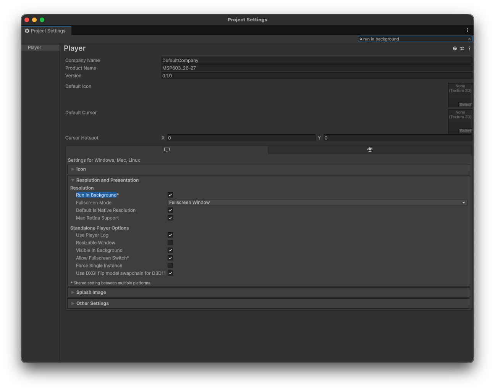
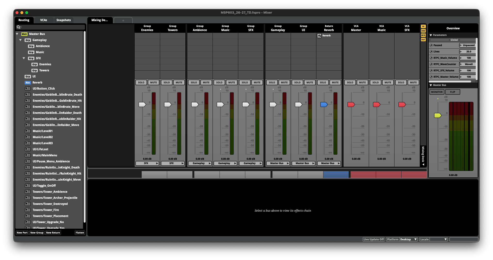

# Setting up FMOD after downloading the project

This guide assumes no previous Unity/FMOD integration experience. Complete Part A before beginning your assessed audio work in Part B.

## Required versions

- Unity Editor `6000.0.78f1`
- FMOD Studio `2.03.14`
- FMOD for Unity `2.03.14`

Use the approved **MSP603 v1.1.0 Student FMOD** package. Do not use GitHub's automatically generated source archives or a Lecturer Reference package.

## What the Student package contains

The v1.1.0 Student package includes:

- the playable Unity framework;
- FMOD for Unity `2.03.14`;
- the matching Student FMOD Studio project;
- the required event, parameter and bank structure;
- compiled known-good reference banks;
- deliberately incomplete Student authoring work, including mixer/event routing that students must complete where required.

The supplied FMOD Studio project is:

`Audio/FMOD/MSP603_26-27_TD/MSP603_26-27_TD.fspro`

It is the project you continue authoring. **Do not replace it with a newly created or unrelated FMOD project.**

## Part A — confirm the supplied integration

### 1. Open Unity

Open the Student Unity project in Unity `6000.0.78f1`. Allow the initial import, script compilation and FMOD asset refresh to finish before entering Play Mode.

Confirm that:

- an **FMOD** menu is visible;
- **FMOD > Edit Settings** opens;
- official components such as **FMOD Studio Event Emitter** are available;
- the Console contains no FMOD compilation errors;
- the supplied event paths are retained.

*Run In Background allows Unity to keep running while you inspect FMOD during supported Live Update workflows.*

### 2. Test the known-good reference banks first

Before changing the Student FMOD project, run the game and confirm the supplied compiled reference banks play. This separates a Unity/integration problem from a problem in your later FMOD authoring.

The reference banks are diagnostic material. They are not evidence that the Student FMOD authoring project contains the Lecturer's source audio or completed sound design.

### 3. Open the supplied Student FMOD project

Open `Audio/FMOD/MSP603_26-27_TD/MSP603_26-27_TD.fspro` in FMOD Studio `2.03.14`.

The project retains the framework's integration contract, including required event paths, parameters and bank structure. Lecturer source audio is not included. Event content, routing and creative implementation remain for you to author.

*The supplied mixer scaffold provides structure while leaving meaningful event routing for Student authoring.*

### 4. Reintegrate only when necessary

If the FMOD menu or component types are genuinely missing or damaged, use the institution-approved FMOD for Unity `2.03.14` repair/reintegration route.

After repair, continue using the supplied Student `.fspro`. An **Event Not Found** message after reintegration can mean Unity has retained the event path but has not yet resolved the matching FMOD event data. Do not respond by creating a replacement FMOD project.

See [Troubleshooting and Support](Troubleshooting.md) before deleting or replacing project content.

## Part B — author your assessed audio

### 1. Preserve the framework contract

Work within the supplied Student FMOD project. Preserve required event paths, parameter names/labels, bank identities and other documented structures that Unity uses to communicate gameplay state.

The framework supplies the technical hooks. Your assessed contribution is the audio and the creative/technical behaviour you build with them, according to the current assessment brief.

### 2. Author, build and verify incrementally

Use a simple cycle:

1. make one clear authoring change in the supplied FMOD project;
2. assign your source audio and implement the required behaviour;
3. route the event appropriately;
4. build the relevant bank(s);
5. allow Unity to refresh the FMOD data;
6. verify the change in Play Mode.

Do not make a large set of changes before confirming that the basic authoring/build/refresh cycle works.

### 3. Use the supplied parameters and state hooks

v1.1.0 includes, among the wider framework controls:

- global labelled `Paused`, through which Unity reports whether gameplay is paused;
- local continuous `Proximity` on each tower's ambience instance;
- existing tower parameters such as `TowerType`, `UpgradeLevel` and `Activity`.

Unity reports the gameplay state. **You decide in FMOD what that state sounds like.** See the [FMOD Authoring Reference](FMODAuthoringReference.md).

### 4. Understand spatialisation

Do not treat parameter-driven Proximity as automatically equivalent to FMOD 3D spatialisation. The framework supports teaching distinctions between:

- 2D audio;
- genuine FMOD 3D spatialisation;
- parameter-driven spatial response.

Choose and justify the approach appropriate to your work and the assessment brief.

### 5. Live Update / live control

Unity's **Run In Background** setting is enabled so that Play Mode can continue while FMOD has focus. Where supported by the teaching setup, this allows FMOD Live Update/live-control workflows while the game continues running.

## Teaching exercise versus assignment framework

A lecturer may use a clean or empty FMOD project in a teaching exercise so that you learn how to create a parameter, event, bank or routing structure from the beginning.

That does **not** mean you should discard the matching Student FMOD project supplied for the assessment framework.

The intended sequence is:

**learn it from scratch → understand it → find the corresponding structure in the Student project → apply your own implementation.**

## You are ready when…

- [ ] You are using Unity `6000.0.78f1`, FMOD Studio `2.03.14`, and FMOD for Unity `2.03.14`.
- [ ] Unity imports and compiles without FMOD compilation errors.
- [ ] The supplied reference banks play before you begin replacing them.
- [ ] The supplied Student `.fspro` opens normally in FMOD Studio.
- [ ] You understand that the Student FMOD project is a scaffold, not the completed Lecturer solution.
- [ ] You can make one authoring change, build the relevant bank, refresh Unity and hear/observe your change.
- [ ] You understand that routing and other creative/technical implementation remain part of your own work.

For recovery steps and reporting requirements, see [Troubleshooting and Support](Troubleshooting.md).
