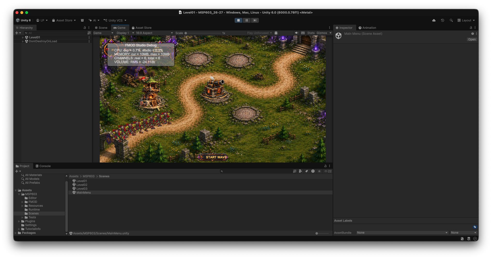
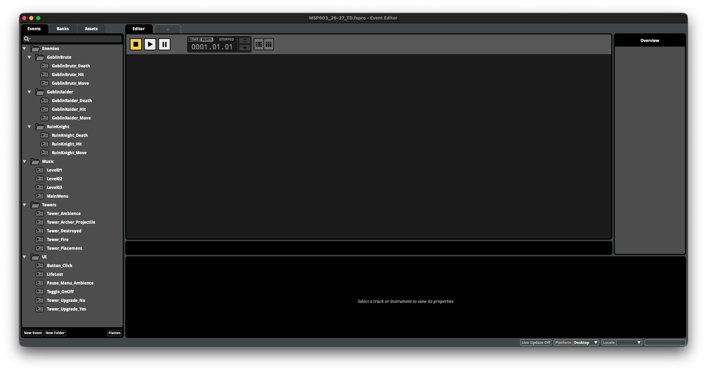

# Getting started

## Before you begin

Use the approved **MSP603 v1.0.0 Student FMOD** package supplied through the VLE or the student-only release surface. Do not use GitHub's generated source archives.

## Open the Unity project

1. Extract the ZIP to a normal writable working folder; do not run it from the Downloads folder or inside the ZIP.
2. In Unity Hub, add the extracted project folder.
3. Open it in Unity `6000.0.78f1` and allow the first import to complete.
4. Open `Assets/MSP603/Scenes/MainMenu.unity` and enter Play Mode.
5. Select **Play Level 1** to confirm the gameplay project opens with 20 lives and offers Cannon, Archer, Mage, and Inferno on a build pad.

*Level 1 provides a quick gameplay and audio-integration check.*

## What is intentionally incomplete

The project includes three playable levels, gameplay, accessible authoring objects, official FMOD components, and runtime state hooks. You provide your own FMOD project, banks, event assignments, parameters, mixing, and sound design. Empty student event/bank assignments are intentional. Continue with [Setting Up FMOD After Downloading the Project](FMODSetupGuide.md).

*The supplied Student FMOD project retains the event structure required by the framework.*
