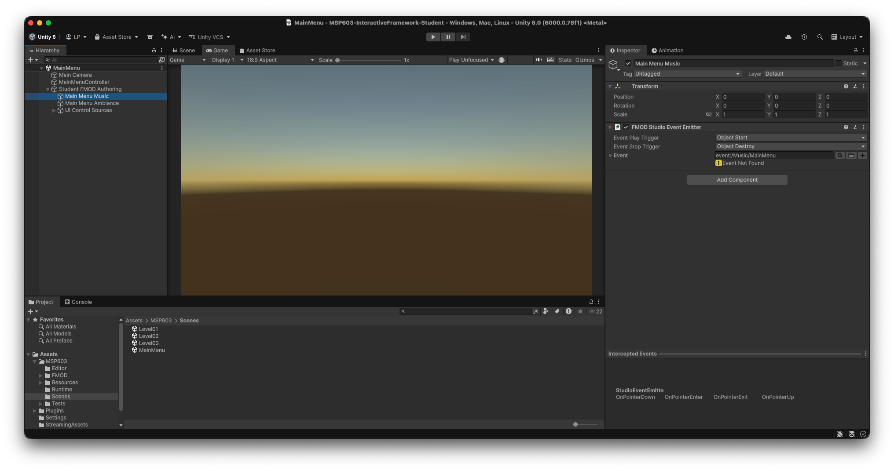

# Troubleshooting and Support

Use this guide when the MSP603 Student project does not behave as expected.

The most important troubleshooting principle is:

**Identify whether the problem is in the supplied framework or in your own FMOD implementation before changing the project structure.**

Do not begin troubleshooting by deleting events, recreating parameters, replacing the supplied FMOD Studio project or changing software versions.

---

## Start with the reference implementation

The v1.1.0 Student package contains compiled reference banks.

These provide a known-good starting point.

Before making substantial changes, check whether the supplied reference audio works in Unity.

If the reference implementation works, this strongly suggests that the Unity gameplay framework and its basic FMOD integration are functioning.

If something stops working after you build your own banks, investigate your FMOD authoring before changing the Unity framework.

Useful checks include:

- event content;
- bank assignment;
- successful bank build;
- mixer routing;
- event volume or mute state;
- parameter behaviour;
- event triggering;
- spatial behaviour.

This distinction can save a great deal of unnecessary rebuilding.

---

## FMOD transfer or reinstall recovery

FMOD for Unity integrations can occasionally require repair after a project is downloaded, copied, zipped, unzipped or transferred between machines.

The v1.1.0 Student package includes the matching Student FMOD Studio project required by the framework.

Do **not** replace it with a newly created FMOD project as part of routine troubleshooting.

### 1. Check your versions

Confirm that you are using:

- Unity `6000.0.78f1`
- FMOD Studio `2.03.14`
- FMOD for Unity `2.03.14`

Do not upgrade or downgrade the project unless instructed by your lecturer.

### 2. Allow Unity to finish

When opening the project for the first time, allow Unity to complete importing and compilation.

Check the Console for errors before assuming that FMOD itself is broken.

### 3. Check the FMOD integration

Look for:

- the **FMOD** menu in Unity;
- official FMOD components in the Inspector;
- existing FMOD Event Emitter components;
- existing event paths on supplied authoring objects.

If these are present, do not immediately reinstall the plugin.

### 4. Check the supplied FMOD project

The Student FMOD project is:

`Audio/FMOD/MSP603_26-27_TD/MSP603_26-27_TD.fspro`

This is the FMOD Studio project intended to accompany the supplied Unity project.

Do not create a replacement `.fspro` simply because the integration needs repairing.

### 5. Repair the plugin only when necessary

If the FMOD menu/components are genuinely missing, damaged, or Unity reports relevant FMOD compilation problems, use the institution-approved recovery method for **FMOD for Unity `2.03.14`**.

Do not delete project content or install a different FMOD version without lecturer guidance.

After repair:

1. reopen the project in Unity `6000.0.78f1`;
2. allow importing and compilation to finish;
3. confirm that the supplied event paths remain present;
4. continue using the supplied Student `.fspro`;
5. build the appropriate banks when required;
6. refresh/test Unity.

The v1.1.0 workflow has been designed so that the matching Student FMOD project remains part of the integration rather than being discarded during recovery.

---

## An Event Emitter says `Event Not Found`

Do not immediately recreate the event.

First check:

1. Is the Event Emitter still displaying the expected `event:/...` path?
2. Is the supplied Student FMOD project being used?
3. Does that event exist in FMOD Studio?
4. Is it assigned to the appropriate bank?
5. Has the bank been built?
6. Has Unity refreshed its FMOD event/bank information?

There is an important difference between:

- an event path being completely lost; and
- an existing path temporarily not resolving against the currently available FMOD data.

Preserve the supplied path while investigating the cause.

*This is a troubleshooting state, not the desired final state: the path is retained, but FMOD event data is unresolved. Keep the matching supplied Student `.fspro` while recovering the connection.*

---

## The game is completely silent

First determine **when** it became silent.

### It was silent before I changed anything

Check:

- Unity and FMOD versions;
- Unity Console errors;
- whether FMOD for Unity loaded correctly;
- whether the supplied reference banks are present;
- Music/SFX settings;
- whether the correct scene is running.

If the supplied reference implementation has never worked, avoid making large authoring changes until the underlying problem is identified.

### It became silent after I built my own banks

This points more strongly towards the FMOD authoring/build side.

Check:

- whether your events contain audio;
- bank membership;
- successful bank build;
- mixer routing;
- bus mute/volume state;
- parameter automation;
- whether the correct banks were built.

---

## My event works in FMOD Studio but not in Unity

Check:

1. Did you save the FMOD project?
2. Did you build the relevant bank?
3. Did Unity refresh the bank?
4. Is the event assigned to the expected bank?
5. Is the Unity source using the expected event?
6. Is the event routed somewhere audible?
7. Does the gameplay action actually trigger it?

A working FMOD Studio preview does not by itself prove that Unity is currently playing the latest built bank.

---

## One tower or enemy is silent

For dynamically created gameplay objects, work with the appropriate source Prefab under:

`Assets/MSP603/Resources/StudentAuthoring/`

Do not rely on editing a temporary runtime clone created during Play Mode.

Check:

- the correct source Prefab;
- Event Emitter configuration;
- event content;
- bank assignment;
- mixer routing;
- local parameter behaviour;
- whether the relevant gameplay action occurs.

---

## Parameters do not respond

Check:

- exact parameter spelling;
- Global versus Local scope;
- Continuous, Discrete or Labelled type;
- expected range or labels;
- whether your FMOD event actually uses the parameter;
- whether you are observing the correct event instance.

Use the [FMOD Authoring Reference](FMODAuthoringReference.md) for the framework's approved parameter definitions.

### Local tower parameters

For:

- `TowerType`
- `UpgradeLevel`
- `Activity`
- `Proximity`

remember that each tower can have its own parameter state.

Testing one tower does not necessarily tell you what another tower instance is receiving.

FMOD Live Update can be useful for investigating this behaviour.

---

## `Proximity` does not behave as expected

`Proximity` is a local continuous parameter for each placed tower.

It is based on the relationship between the cursor and that tower.

Check:

- that you are testing a placed tower;
- that the event uses the local `Proximity` parameter;
- that your automation covers the `0.0`–`1.0` range;
- that you are observing the correct tower instance.

Remember that `Proximity` is **parameter-driven gameplay information**.

It is not a second FMOD listener and is not the same thing as genuine FMOD 3D distance attenuation.

See the [FMOD Authoring Reference](FMODAuthoringReference.md) for the distinction.

---

## Pause behaviour does not respond

The framework publishes the global labelled parameter:

`Paused`

with:

- `Unpaused`
- `Paused`

Check:

- that the parameter exists with the correct name and labels;
- that your FMOD implementation actually uses it;
- that the game is entering and leaving pause correctly.

Unity reports the state.

It does not automatically prescribe the sonic response.

If you are using `event:/UI/Pause_Menu_Ambience`, also check its event content, bank assignment and behaviour when entering and leaving pause.

---

## Settings do not affect the mix

First identify what you are listening to.

The framework distinguishes between gameplay Music, gameplay SFX, Ambience and UI audio.

Check:

- `RTPC_Master_Volume`;
- `RTPC_Music_Volume`;
- `RTPC_SFX_Volume`;
- mixer routing;
- bus/VCA behaviour;
- Music/SFX enable-switch behaviour.

Do not assume that UI audio should disappear when gameplay SFX is disabled.

Similarly, an ambience event does not automatically belong to the same control path as tower/enemy SFX.

If a gameplay sound ignores the expected settings control, mixer routing should be one of your first checks.

---

## Live Update does not appear to work

The Unity project is configured to continue running when it loses focus.

If you are using an FMOD Live Update workflow demonstrated during teaching, check:

- Unity is still in Play Mode;
- the correct FMOD project is open;
- the Live Update connection is active;
- the event or parameter you are inspecting is currently active in the game.

Live Update is a diagnostic/development tool.

Your saved project and built banks remain the authoritative implementation.

---

## Quick checks

| Problem | First check |
| --- | --- |
| Game silent before authoring | Reference banks, FMOD integration, Unity Console and settings |
| Game silent after your bank build | Event content, bank build and mixer routing |
| Event missing | Supplied project, event path, bank membership, build and refresh |
| `Event Not Found` | Preserve the event path; check project, bank and refresh state before recreating anything |
| One tower/enemy silent | Source Prefab rather than a runtime clone |
| Parameters do not respond | Exact name, scope/type, values and correct event instance |
| `Proximity` does not respond | Correct tower instance and local `0.0`–`1.0` parameter automation |
| Pause behaviour does not respond | Global `Paused` parameter and your authored response |
| Settings do not affect expected sounds | Mixer routing and Music/SFX/UI distinction |
| FMOD menu/components missing | Correct FMOD for Unity `2.03.14` integration |
| FMOD works but Unity plays old audio | Save and rebuild the appropriate banks |

---

## Before making a destructive change

Stop and ask for support before:

- deleting the supplied FMOD Studio project;
- creating replacement versions of supplied framework events;
- recreating supplied parameters;
- changing event paths;
- regenerating integration identities;
- installing a different Unity version;
- installing a different FMOD version;
- deleting project folders because an event cannot currently be found.

Most authoring problems do not require these actions.

---

## Reporting a problem

Use **Report a Bug** in the Main Menu or pause menu.

If the framework cannot open, use the MSP603 bug-report form provided through the module VLE.

Include:

- scene;
- action;
- expected result;
- actual result;
- reproducible steps;
- Unity version;
- FMOD version;
- whether the supplied reference audio worked before you changed anything;
- whether the problem occurred before or after building your own banks.

Screenshots of relevant Unity Inspector, Console or FMOD state can also help diagnose the problem.

Do not include passwords, credentials or unnecessary personal information.

For the complete setup workflow, see the [FMOD Setup Guide](FMODSetupGuide.md).
